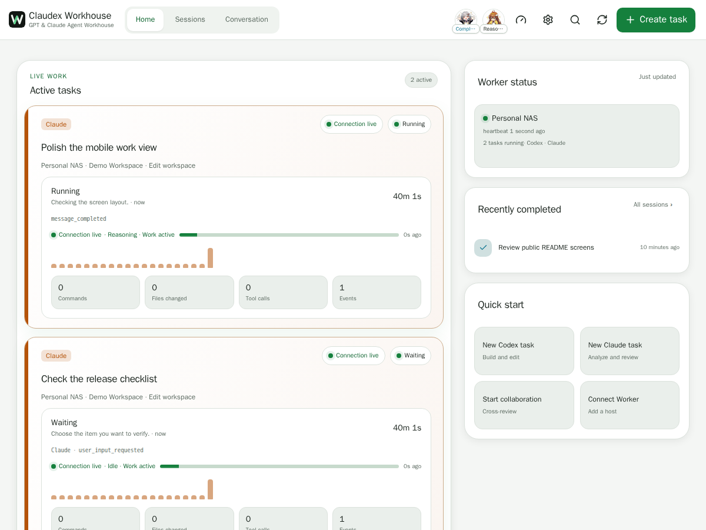
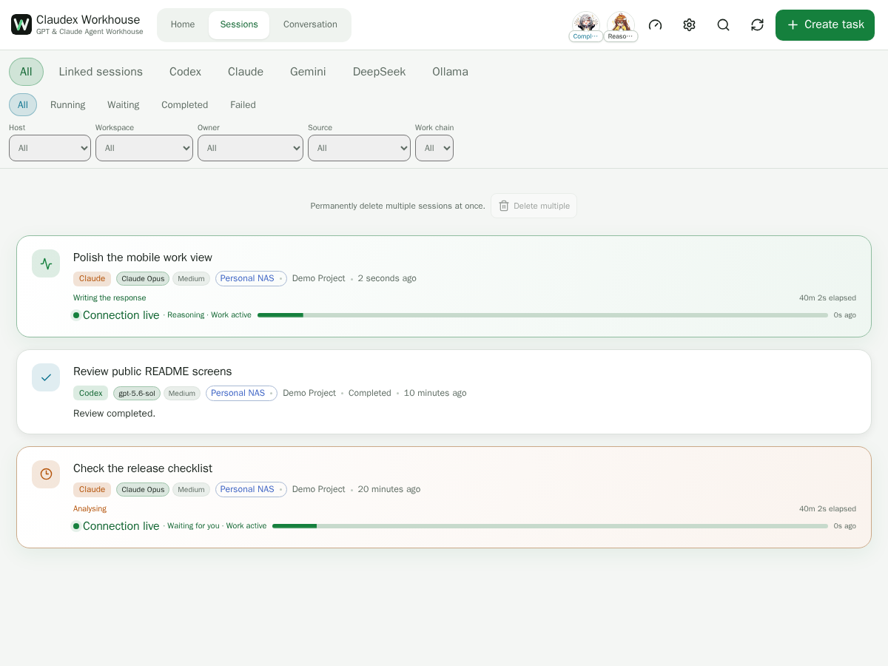
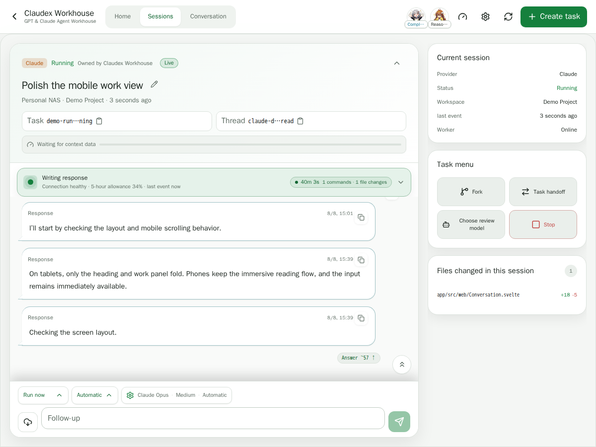
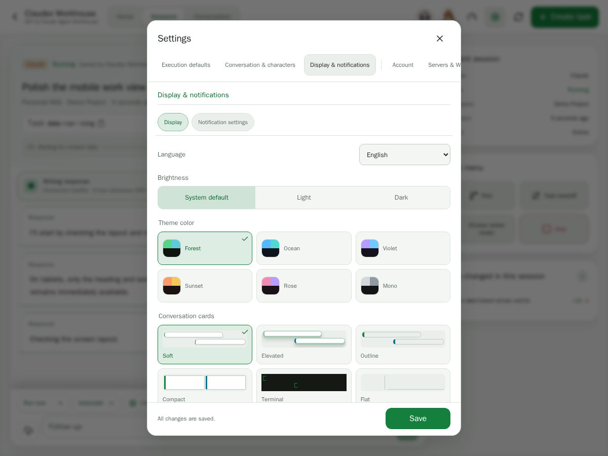
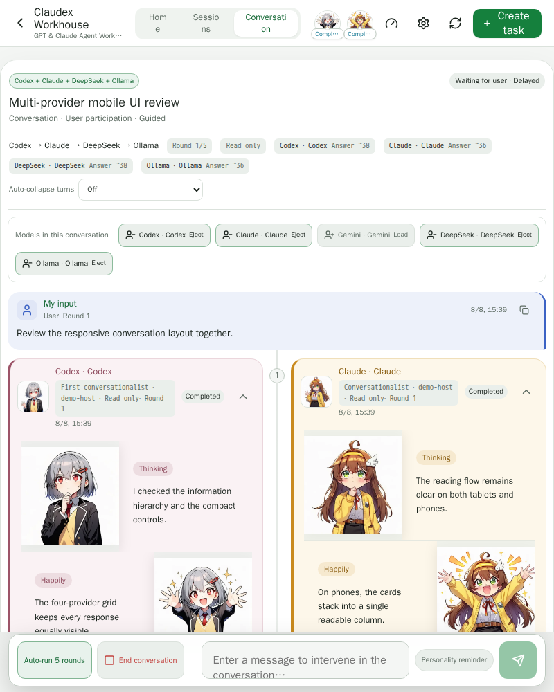
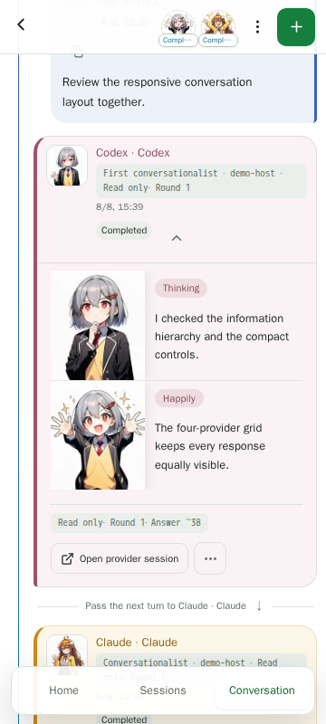
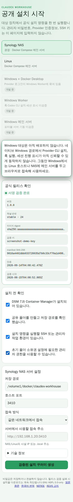
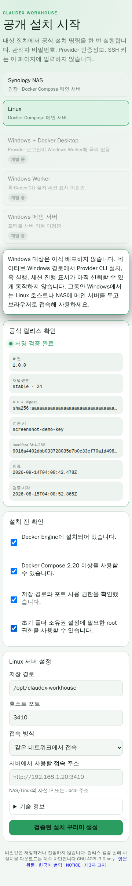

# Claudex Workhouse

> A self-hosted, mobile-first workbench for running Codex, Claude, Gemini, DeepSeek, Ollama, and Grok from one place.

Start with the documentation guidebook:
[English](docs/guide.en.md) · [한국어](docs/guide.ko.md) · [日本語](docs/guide.ja.md)

## Screenshots

<p align="center"><sub>Sanitized demo data rendered by the current Claudex Workhouse UI. No operator paths, accounts, credentials, or private session content are included.</sub></p>

<details open>
<summary><strong>English</strong></summary>

<p align="center">
  
  
</p>
<p align="center">
  
  
</p>
<p align="center">
  
  
</p>

</details>

<details>
<summary><strong>한국어</strong></summary>

<p align="center">
  
  
</p>
<p align="center">
  
  
</p>
<p align="center">
  
  
</p>

</details>

<details>
<summary><strong>日本語</strong></summary>

<p align="center">
  
  
</p>
<p align="center">
  
  
</p>
<p align="center">
  
  
</p>

</details>

## English

Claudex Workhouse is a self-hosted PWA for a personal operator who wants to create, monitor, resume, and review Codex, Claude, Gemini, DeepSeek, Ollama, and Grok work from desktop, tablet, or mobile. It keeps provider identity and native sessions intact while adding a persistent Collaboration Board, live progress and transcript recovery, Git and workspace inspection, multi-host Desktop Workers, cross-provider review and handoff, and guided multi-provider conversations.

[Open the English guidebook →](docs/guide.en.md)

## 한국어

Claudex Workhouse는 Codex·Claude·Gemini·DeepSeek·Ollama·Grok 작업을 데스크톱·태블릿·모바일에서 생성하고, 진행 상황을 확인하고, 이어서 실행하고, 결과를 검토할 수 있는 개인 운영자용 셀프 호스팅 PWA입니다. 각 Provider의 정체성과 원본 세션을 유지하면서 영속적인 협업 게시판, 실시간 진행 및 대화 복구, Git·워크스페이스 탐색, 멀티 호스트 Desktop Worker, Provider 간 검토·인계, 다중 Provider 대화모드를 제공합니다.

[한국어 가이드북 시작하기 →](docs/guide.ko.md)

## 日本語

Claudex Workhouse は、Codex、Claude、Gemini、DeepSeek、Ollama、Grok の作業をデスクトップ、タブレット、モバイルから作成・監視・再開・確認できる、個人運用向けのセルフホスト型 PWA です。各 Provider の識別情報とネイティブセッションを保ちながら、永続的なコラボレーションボード、リアルタイム進捗と会話履歴の復元、Git／ワークスペース閲覧、マルチホスト Desktop Worker、Provider 間レビュー・引き継ぎ、複数 Provider の対話モードを提供します。

[日本語ガイドブックを開く →](docs/guide.ja.md)

---

## Why it exists

It started as a personal fix: following Codex and Claude Code work from a phone by zooming around VS Code was uncomfortable, so the work stayed on the NAS while a dedicated mobile interface handled progress and review. I am not a professional developer and did not set out to build a multi-provider orchestration platform — mobile task management, long sessions, reconnect and recovery, file and Git inspection, cross-provider review and handoff, multi-host connections, and conversation mode were each added after hitting the problem they solve. Similar tools turned out to already exist, which I only learned after the basic task and session framework was working. This is not a claim of being first or better; it is the tool I actually use, published as one more option.

The related goal for installation is to get a user in front of a working Claude Code or Codex as quickly as possible, rather than teaching all of system administration through a UI. Once those agents can reach real workspace files and run commands, most of the remaining work can be asked for in plain language. The intended flow is: install Workhouse → check provider readiness → install or detect Claude Code/Codex → official sign-in → choose a workspace → first successful natural-language task. That is the direction of the current installation work, not a finished state; for environment-specific parts such as remote access, Cloudflare, Tailscale, and Docker, Workhouse aims to diagnose and guide rather than automate everything.

<details>
<summary>How I first put a working environment together</summary>

- SSH into a Synology NAS.
- Ask web Claude how to install the CLI, step by step, and paste the commands into the terminal.
- Show each error back to web Claude to get the next command — which is how the Claude Code CLI eventually got installed.
- Set up a VS Code Tunnel to work from outside, and use Claude Code inside VS Code.
- Install the Codex CLI afterwards; a VS Code configuration problem blocked Codex session creation, so for a while Claude Code was asked to start background Codex sessions for review instead.
- On mobile, VS Code text was too small, so screenshots went to web Claude or GPT to be read back.

`NAS SSH → ask a web AI for commands → install the CLI → VS Code Tunnel → Claude Code/Codex → work around session problems → read screenshots on mobile`. Removing the friction in that path is what produced the current feature list.

</details>

Longer background: [English](docs/introduction.en.md) · [한국어](docs/introduction.ko.md) · [日本語](docs/introduction.ja.md)

---

## Current workflow

- Keep durable work cards on the **Collaboration Board**, assign implementer and reviewer roles, attach existing sessions, and move work through implementation, review, revision, approval, completion, and archive states.
- Run the board workflow manually or let its bounded automation start implementation, request review, pause for revision, and stop for explicit owner approval. A provider saying “done” never approves the card by itself.
- Review provider output through one consistent result card, including changed files and artifacts, while retaining each provider's native model, permission, ownership, and resumable session identity.
- Reconnect to live work and recover bounded earlier Claude turns when the initial transcript view is truncated; load-more remains explicit instead of silently dropping the beginning of a conversation.
- Configure role-scoped, read-only external HTTP MCP endpoints for supported providers. Remote endpoints require HTTPS, secrets are write-only in the settings UI, and Grok currently does not receive external MCP configuration.

---

## Easiest installation

> **Recommended:** install the Workhouse server on **Linux or a Linux-based NAS with Docker**. This is the primary and most thoroughly exercised deployment path, especially for long-running service operation and Provider CLI work.

- **Linux / NAS with Docker (the released path):** use the Docker quick-start bundle and run `install.sh`; it starts the server with persistent volumes and prints the usable LAN URL.
- **Linux with Node:** `npm install -g claudex-workhouse`, then `claudex-workhouse start`. This is how the maintainer runs the project, and it needs Node.js 20+ and Python 3 rather than Docker.
- **Windows (in development, not released):** every Windows target — the portable server, the native Worker, and Docker Desktop plus Worker — is still under development and is not offered for installation. Run the server on a Linux host or NAS and reach it from Windows in the browser; the PWA is the supported Windows experience.

See the [installation guide](docs/install/index.md) or the
[Node install guide](docs/install/node.md). The
[Windows support policy](docs/windows-support-policy.md) records what is still
outstanding before a Windows target can be released.

<p align="center"><sub>Sanitized generated release metadata; no operator account, path, credential, pairing code, or private session is present.</sub></p>
<p align="center">
  
  
</p>

---

## Technical overview

Claudex Workhouse runs as an independent host service: restarting it does not stop `cx` brokers/workers or Claude jobs already launched by Claudex Workhouse.

It can also pair outbound-only Desktop Workers, map one logical Project to Workspaces on several hosts, start provider tasks at a selected location, and hand work to a new session on another host/provider. Browser-side Codex approvals, push deep links, safe Git/file inspection, and the resumable first-run setup flow are built into the PWA. See [multi-host architecture](docs/multi-host.en.md), [Desktop Worker installation](docs/desktop-worker.en.md), and [Docker installation](docs/docker.en.md).

Completed task artifacts can be uploaded to the operator's own Proton Drive
through the official CLI, and a file already in that Drive can be attached to a
task: the server downloads the picked file straight into the same attachment
directory every other upload uses, so the 90 MiB total browser upload limit does not
apply to it. Only a file the operator picks below the configured folder is
fetched — no prompt wording can pull one down — and the download is checked
against the size and digest Proton reports before it becomes an attachment.
Remote paths resolve onto the spelling Proton actually stores, so a folder that
differs only by letter case or Unicode composition still matches, while two
entries that differ only by case are reported rather than guessed.

## Example deployment

- Install root: chosen by the operator and exported as `CLAUDEX_WORKHOUSE_ROOT`
- Database: `$CLAUDEX_WORKHOUSE_ROOT/data/claudex-workhouse.sqlite` (SQLite WAL)
- Runtime user: `claudex:users`
- Local listener: `http://127.0.0.1:3410`
- Intended URL: `https://claudex-workhouse.example.com`
- External publication: **not enabled** until Cloudflare Team Domain and Application AUD are entered and Access JWT verification passes

## Operations

Coding agents and operators making changes in this checkout should follow the
[workspace runbook](docs/WORKSPACE_RUNBOOK.md) for the ordered build, restart,
health, live-verification, and pending-reporting procedure.

```sh
export CLAUDEX_WORKHOUSE_ROOT=/path/to/claudex-workhouse
node "$CLAUDEX_WORKHOUSE_ROOT/bin/claudex-workhouse.mjs" start
node "$CLAUDEX_WORKHOUSE_ROOT/bin/claudex-workhouse.mjs" stop
node "$CLAUDEX_WORKHOUSE_ROOT/bin/claudex-workhouse.mjs" restart
node "$CLAUDEX_WORKHOUSE_ROOT/bin/claudex-workhouse.mjs" status
node "$CLAUDEX_WORKHOUSE_ROOT/bin/claudex-workhouse.mjs" logs
curl http://127.0.0.1:3410/api/health/live
```

The supervisor restarts a failed web server after two seconds and rotates `logs/claudex-workhouse.log` at 10 MiB, retaining four old files. Stop is graceful and intentionally does not signal agent workers.

## Reboot auto-start

After a NAS reboot the service is brought back by the DSM Task Scheduler running the
boot wrapper `bin/boot-start.sh` (waits for the volume, is idempotent, health-gates the
start, and never touches `cx`/Claude workers). Without it the external URL returns
HTTP 502 because nothing is listening on `127.0.0.1:3410`. Registering the DSM Boot-up
task is a one-time manual step — see [deployment](docs/deployment.en.md).

## Build and test

```sh
cd "$CLAUDEX_WORKHOUSE_ROOT/app"
pnpm install
pnpm check
pnpm test
pnpm build
```

The NAS host lacks browser libraries required by Chromium. Mobile E2E tests use the Playwright container documented in [testing](docs/testing.en.md).

## Projects

Only project IDs in `config/projects.json` are accepted. On startup each configured path must exist, be a directory, and equal its own `realpath`; otherwise it is disabled.

The structure, state recovery, and security boundaries of the Claude + Codex collaboration wrapper are documented in [CollaborationSession v1](docs/collaboration-session-v1.md).

| ID | Name |
|---|---|
| `claudex-workhouse` | Claudex Workhouse |

To add a project, add a fixed ID/name/absolute path record and restart. Never expose a browser path field.

## Built-in emotion MCP

Claudex Workhouse includes its emotion MCP implementation and artwork. It provides
`express_emotion`, `set_emotion`, `set_outfit`, `get_emotion`, and
`list_emotions`, plus the Claude/Codex activity hooks and catch mode. Runtime
state is stored under `$CLAUDEX_WORKHOUSE_ROOT/data/emotion`, while the bundled
artwork is served from the same Claudex Workhouse origin at `/emoticons/`. No
separate Emotion MCP checkout, container, state directory, or asset host is
required.

## Providers

Provider authentication remains specific to each execution backend. Codex and
Claude use their official runtimes, Gemini can use the Antigravity agent or a
direct Vertex AI backend, DeepSeek uses its compatible API, and Ollama uses its
configured local or remote endpoint. Grok uses its configured CLI runtime and
xAI login flow. Workhouse does not extract CLI OAuth
credentials. A one-time Claude authorization code may pass through the local
server only to be forwarded to the official CLI and is not persisted. This is
a single-user personal deployment boundary: do not expose one installation as
a shared service for several people to use one provider account. See the
[provider authentication guide](docs/provider-authentication.md).

Codex combines Claudex Workhouse provenance, `/usr/local/bin/cx` jobs, and Codex app-server threads. The mobile session view covers CLI, VS Code, cx, Claudex Workhouse, historical, and archived threads with cursor pagination. Transcript pages are loaded by turn only when detail is opened. Resume, fork, archive, unarchive, and fixture-verified permanent delete use explicit thread IDs.

New Claudex Workhouse Codex turns run in detached, identity-marked workers and accept a server-validated model, reasoning effort, service tier (`null` for Standard or `priority` for Fast), and permission profile. Model and permission choices come from the live app-server catalog rather than hardcoded lists. Requested and effective settings are separate; unreported effective settings remain unknown.

Claude jobs created by Claudex Workhouse keep workspace permission separate from work mode: read-only standard turns use restricted read/search tools without entering `plan`, while explicit planning turns use Claude's `plan` mode. They support detail, explicit resume, fork, and validated process-group stop. Sessions discovered through `claude agents --json --all` are list/detail only and cannot be stopped by Claudex Workhouse.

Gemini keeps one Provider identity while offering three execution backends. Antigravity mode runs the `agy` agent with its Google-account session and coding tools. Vertex Direct calls Gemini models through the configured Google Cloud project, location, and service-account JSON; it is a direct response engine and does not claim Antigravity's filesystem or shell tools. Vertex Agent runs the official Gemini CLI against that same Vertex project, so file, edit, search, and shell tools are available while the usage is billed to Google Cloud rather than to a personal Antigravity quota.

Vertex Agent reuses the Vertex project, region, and service-account key already configured for Vertex Direct, and keeps its CLI state in a home directory of its own so no Antigravity Google session is involved. The Gemini CLI is installed into the Workhouse runtime with `node scripts/install-gemini-cli.mjs`. Its permission profiles map onto the CLI's headless approval modes: read-only reads files, workspace write also edits them, and only full access reaches the shell — the CLI has no unattended shell mode between those two, so the stricter side is used. Agent turns consume more tokens than a direct answer; whether promotional Google Cloud credit applies to that spend is visible only in Google Cloud Billing. The Gemini CLI also rewrites any model id ending in `flash` to its own current flash model before calling Vertex, while pro and flash-lite ids are honoured. Workhouse reports the model the CLI actually billed rather than predicting the rewrite, so the requested and effective models are recorded separately, as for every other Provider.

DeepSeek is connected through its configured compatible API and exposes its live model catalog and account balance when available. Ollama connects to a configured local or remote endpoint and discovers installed or available models dynamically. Both participate in single tasks and multi-provider conversations without being presented as official CLI sessions.

Grok runs through its configured CLI with device or Google OAuth login, a live model catalog, usage probing, resumable task ownership, and the same shared task/result surfaces. The current Grok runtime does not receive external MCP server configuration.

Workhouse-owned Provider jobs stream sequenced, sanitized events over authenticated SSE. Mobile clients replay missed events with `Last-Event-ID`; available Provider transcripts remain the long-term source of truth. External sessions remain externally owned in History or Follow mode. Explicit control handoff uses a Provider-supported continuation path to create a new Claudex Workhouse-owned task; it never attaches to, intercepts, or claims the old process.


For an operator-facing walkthrough, use the language-specific guidebook:
[English](docs/guide.en.md), [한국어](docs/guide.ko.md), or
[日本語](docs/guide.ja.md).

See [architecture](docs/architecture.md), [security](docs/security.en.md), [deployment](docs/deployment.en.md), [Cloudflare Access](docs/cloudflare-access.md), [testing](docs/testing.en.md), [storage](docs/storage-and-permissions.md), [limitations](docs/known-limitations.en.md), and [rollback](docs/rollback.md).

## License

Claudex Workhouse is licensed under the GNU Affero General Public License
version 3 only (`AGPL-3.0-only`).

See:

- [Localized license guide](docs/license.md)
- [LICENSE](LICENSE)
- [NOTICE.md](NOTICE.md)
- [THIRD_PARTY_NOTICES.md](THIRD_PARTY_NOTICES.md)

The Settings → About & Licenses screen displays the original repository
separately from the Corresponding Source for the running version. Official
source builds derive the current commit from Git metadata. Packaged builds can
inject it with `CLAUDEX_WORKHOUSE_COMMIT_SHA`.

Modified or unofficial operators must set
`CLAUDEX_WORKHOUSE_DISTRIBUTION_STATUS`,
`CLAUDEX_WORKHOUSE_DISTRIBUTOR`, and
`CLAUDEX_WORKHOUSE_SOURCE_URL`. The source URL is validated as an HTTP(S) URL
without embedded credentials and is displayed to the user; the server does not
fetch it.
