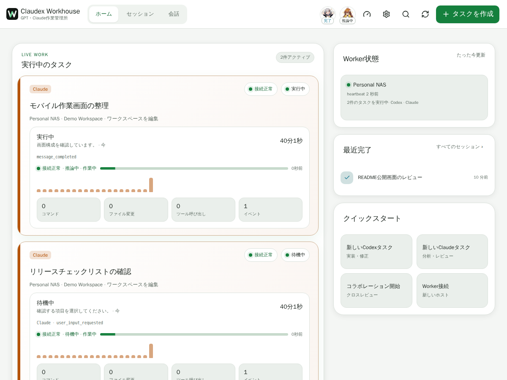
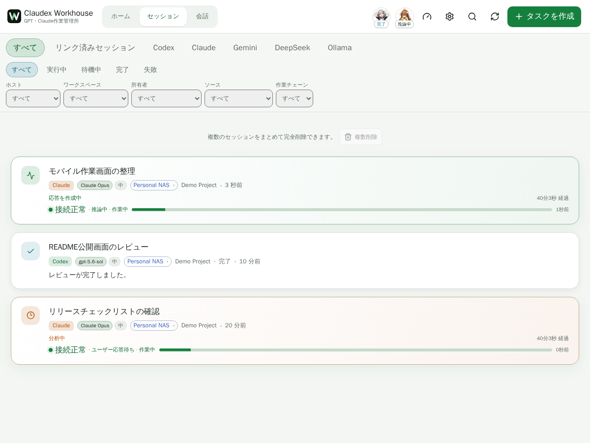
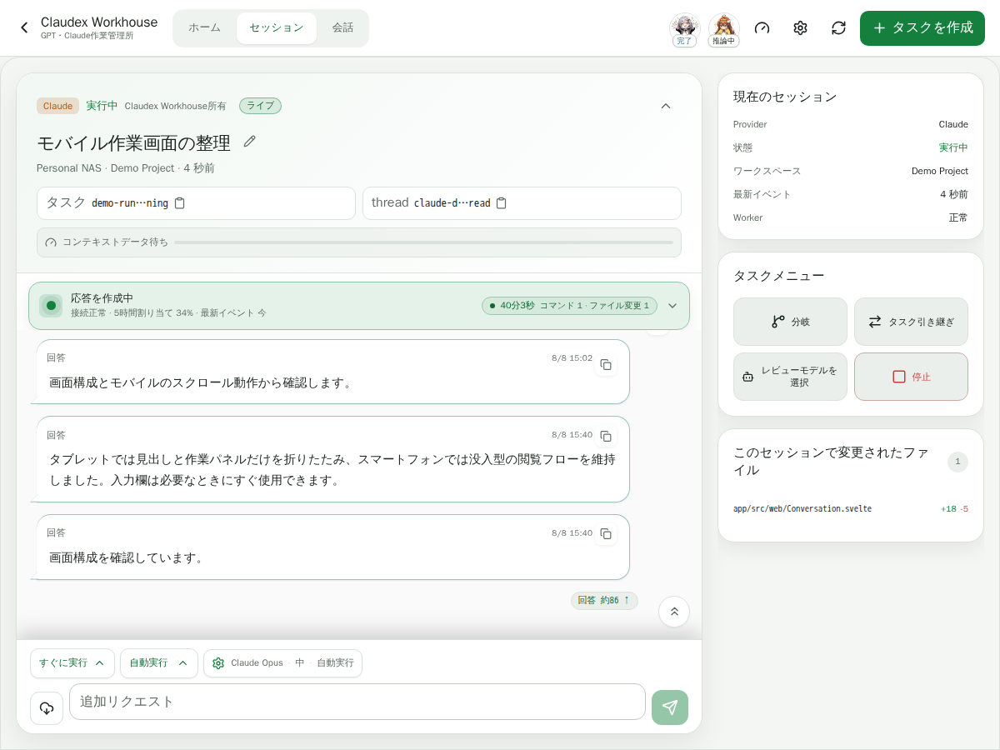
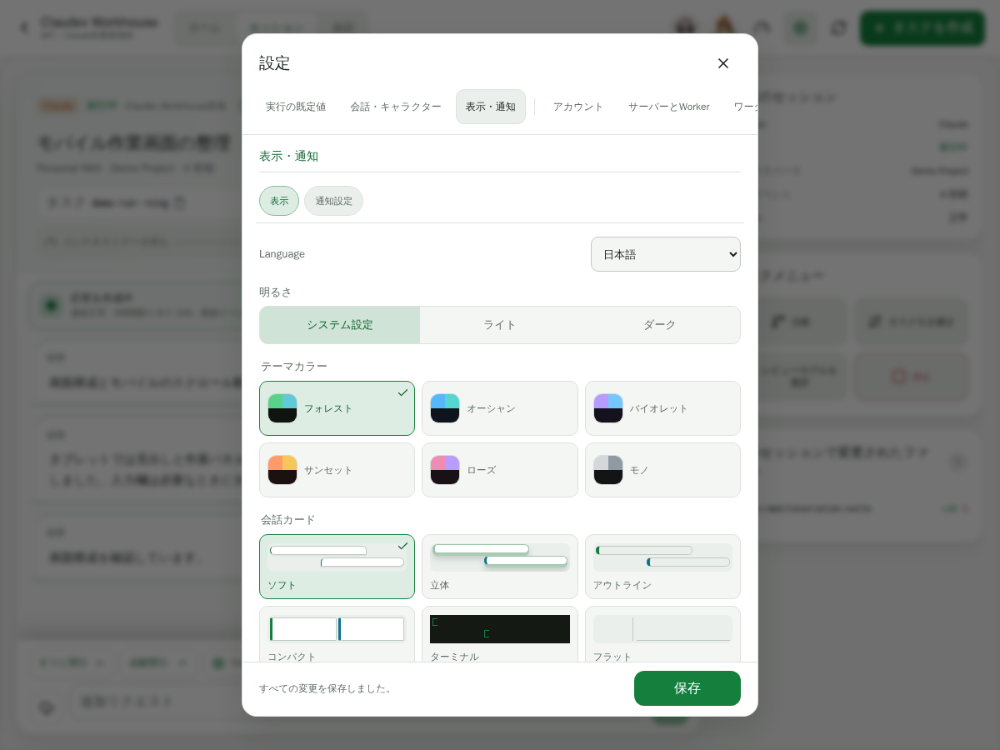
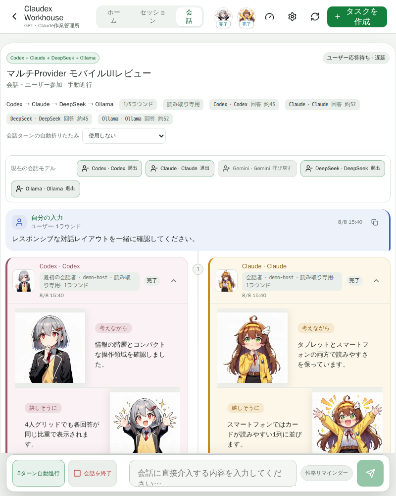
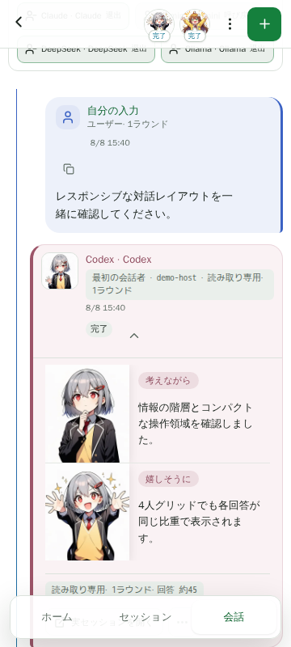

# Claudex Workhouse

[README](../README.md) · [English](introduction.en.md) · [한국어](introduction.ko.md)

[ガイドブック](guide.ja.md) · 次へ: [インストール →](install/index.ja.md)

Claudex Workhouse は、Codex、Claude、Gemini、DeepSeek、Ollama、Grok を一か所で運用するための、セルフホスト型・モバイルファーストのワークベンチです。長時間の作業を開始し、外出先から進捗を確認し、結果をレビューした後も Provider が対応するセッション経路で作業を継続したい個人運用者向けに設計されています。

## スクリーンショット

  
  

  
  

  
  

現在の Claudex Workhouse UI で作成した公開用デモ画面です。実際の運用者のパス、アカウント、認証情報、非公開セッションの内容は含まれていません。

## 主な機能

- Provider を隠さない Codex、Claude、Gemini、DeepSeek、Ollama、Grok 共通のタスク・セッション画面
- 実装者・レビュー担当、関連セッション、永続タイムライン、手動状態変更、所有者承認前の停止を備えたコラボレーションボードと限定的な実装→レビュー→修正の自動化
- 長時間ジョブ向けの順序付きライブ進捗、再接続、未受信イベントの再生
- 全 Provider で統一された最終結果カード、変更ファイル・成果物の文脈、切り詰められた Claude 会話の過去ターン明示読み込み
- ブラウザからの安全なワークスペース、変更ファイル、Git、ログ、ターミナル結果の確認
- Provider が対応する再開、追加依頼、フォーク、停止、アーカイブ、引き継ぎ操作
- 複数の Provider が交互に発言し、感情シーンを保持しながらユーザー入力を受け取れる対話モード
- 対話結果からワークスペース内に Markdown の結論文書を生成
- デスクトップ、タブレット、モバイルに対応したレイアウトとインストール可能な PWA
- 一つの論理プロジェクトを複数マシンのワークスペースへ接続する送信専用 Desktop Worker
- 別サービスを必要としない内蔵 Emotion MCP と同梱アートワーク
- 対応 Provider に役割別の読み取り専用ツールを接続する外部 HTTP MCP 設定、HTTPS 強制、再表示しない secret、運用者確認

## なぜ作ったのか

出発点は単純でした。スマートフォンで VS Code の画面を拡大し、あちこち動かしながら Codex と Claude Code の作業を確認するのが、とても不便だったからです。作業そのものは NAS や PC で実行し、スマートフォンでは進捗と結果を快適に確認できる専用画面が必要でした。また、既存の公式 AI アプリでは、私が使っていた MCP ベースの感情画像やキャラクター表現を作業フローへ組み込むことが困難でした。

私は専門の開発者ではなく、これを作る前は Linux のコマンドもほとんど知りませんでした。最初からマルチ Provider のオーケストレーション基盤を設計したわけではなく、実際に使いながら詰まった箇所を一つずつ解消してきました。モバイルでの作業管理、長時間セッション、再接続と復旧、ファイルや Git の確認、Provider 間のレビューと引き継ぎ、複数の実行マシンとの接続、対話モードは、いずれもその過程で必要になるたびに追加された機能です。

基本的なタスク・セッション管理の枠組みを作った後になって、同じような目的のツールがすでに存在することを知りました。最初は、別のプロジェクトを作り続けることに意味があるのか悩みもしました。

このプロジェクトは、新しい分野を切り開いた、あるいは既存のツールより優れていると主張するためのものではありません。同じような必要性を持つ人にとってもう一つの選択肢となるよう、私が実際に使っているツールを公開します。

最初に作業環境を用意したときの流れ

Workhouse を作る前に、私が Claude Code と Codex を使い始めた経路はおおよそ次のようなものでした。

- Synology NAS へ SSH で接続
- Web 版 Claude に CLI のインストール方法を一つずつ質問し、返ってきたコマンドを端末に貼り付ける
- エラーが出たらその内容をまた Web 版 Claude に見せ、次のコマンドを受け取る、という形でどうにか Claude Code CLI を導入
- 外出先から作業するために VS Code Tunnel を構成し、VS Code 内で Claude Code を使用
- その後 Codex CLI を導入したが、VS Code の設定問題で Codex セッションが作成できず、しばらくは Claude Code に Codex のバックグラウンドセッションを作らせてレビューを任せる形で回避
- モバイルでは VS Code の文字が小さすぎるため、画面をスクリーンショットで撮って Web 版 Claude や GPT に読み上げてもらいながら作業

まとめると `NAS SSH → Web の AI にコマンドを質問 → CLI 導入 → VS Code Tunnel → Claude Code/Codex → セッション問題の回避 → モバイルでのスクリーンショット判読` に近い経路でした。この経路の不便を一つずつ取り除く作業が、そのまま Workhouse の機能一覧になりました。

## なぜ Provider の接続を先に簡単にしようとしているのか

初心者にとって最初の最大の壁は、Linux・Docker・Git の知識そのものではなく、AI が実際のワークスペースのファイルとコマンド実行環境へアクセスできる状態を作ることだと考えています。私が Workhouse を作れたのも、プログラミングのコマンドを自分で習得したからではなく、Claude Code と Codex が実際の作業環境へアクセスできるようになった後は、「この機能を作って」「エラーの原因を突き止めて直して」「Claude が実装したものを Codex にレビューさせて」といった自然言語の依頼で作業を任せられたからです。

そのため、インストール体験で重視している目標は、システム管理の知識をすべて UI で教えることではなく、利用者をできるだけ早く作業可能な Claude Code / Codex の前まで連れて行くことです。目指している流れは `Workhouse の導入 → Provider の準備状況の確認 → Claude Code / Codex の導入または検出 → 公式ログイン → ワークスペースの選択 → 最初の自然言語タスクの成功` です。これは完了した状態ではなく、現在のインストール改善が向かっている方向です。

外部接続、Cloudflare、Tailscale、Docker の詳細設定のように環境ごとに複雑さが大きく変わる部分は、すべてを自動化しようとするより、Workhouse が診断と案内を提供し、必要であれば既に接続済みの Claude / Codex へ自然言語で助けを求められるようにするほうが現実的だと考えています。開発者でなくても AI の作業環境を運用できる可能性はありますが、あらゆる環境問題が解消すると主張するものではありません。実際の手順は [インストール](install/index.ja.md) を参照してください。

## Provider 固有の仕組みを維持

Claudex Workhouse は、6つの Provider を出所不明の汎用エージェントへ統合しません。Provider 名、モデルと権限の選択、タスクの所有者、再開可能なセッション ID を明確に表示します。Gemini は Antigravity エージェント、Vertex Direct 応答エンジン、または Vertex Agent（同じ Vertex プロジェクトで動作する公式 Gemini CLI）、DeepSeek、Ollama、Grok は設定済みランタイムまたは API エンドポイントを使用します。外部で開始されたセッションは外部所有のまま扱い、運用者が明示的に選択した場合にだけ、各 Provider が対応する方法で Workhouse 管理の継続タスクを作成します。

Web サービスと実際の Provider Worker も分離されています。Workhouse の UI と supervisor を再起動しても、すでに実行中の Codex／Claude ジョブを終了しない設計です。

## 個人向けセルフホスト運用

本プロジェクトはマルチユーザー SaaS の管理画面ではなく、信頼できる個人環境を対象としています。プロジェクトはサーバー側の許可リストからのみ選択でき、ワークスペースパスはホスト上で検証されます。外部公開が必要な場合は Cloudflare Access の背後に配置できます。データはローカル SQLite に保存され、NAS または他の Node.js ホスト上で直接実行できます。

認証は実行バックエンドごとの境界を維持します。Codex と Claude は公式ランタイム、Gemini は Antigravity の Google セッションまたは Vertex のサービスアカウント、DeepSeek、Ollama、Grok は運用者が設定したランタイム、エンドポイント、必要な秘密情報を使用します。Claude のワンタイム認証コードは CLI へ渡すためにローカルサーバーを一時的に通過する場合がありますが保存されません。詳細は [Provider 認証方式](provider-authentication.ja.md) を参照してください。

## マルチユーザー対応

Claudex Workhouse は、信頼できる個人環境のためのシングルユーザーツールです。

マルチユーザー環境では、プロジェクト、ワークスペース、Provider アカウント、実行権限、Worker、認証情報、セッション履歴をユーザーごとに安全に分離する必要があります。現在の構成はそのようなセキュリティ境界を提供していないため、チームや組織での利用には対応していません。

単純なログイン機能を追加して複数のユーザーで一つの環境を共有する方法は安全ではなく、マルチユーザー対応は現在の開発範囲に含まれていません。

インストールと運用については、次の文書を参照してください。

- [デプロイ](deployment.ja.md)
- [Docker インストール](docker.ja.md)
- [Desktop Worker インストール](desktop-worker.ja.md)
- [マルチホスト構成](multi-host.ja.md)
- [セキュリティモデル](security.ja.md)
- [Provider 認証方式](provider-authentication.ja.md)
- [テスト](testing.ja.md)
- [既知の制限](known-limitations.ja.md)

## ライセンス

Claudex Workhouse は `AGPL-3.0-only` でライセンスされています。詳細は [日本語ライセンス案内](license.ja.md)、法的効力を持つ英語の [LICENSE](../LICENSE)、[非公式日本語訳](../LICENSE.ja.md)、[NOTICE](../NOTICE.ja.md) を参照してください。
