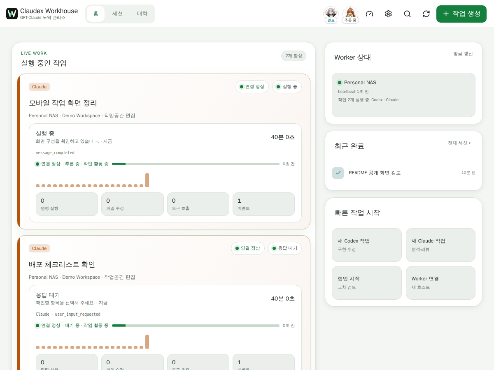
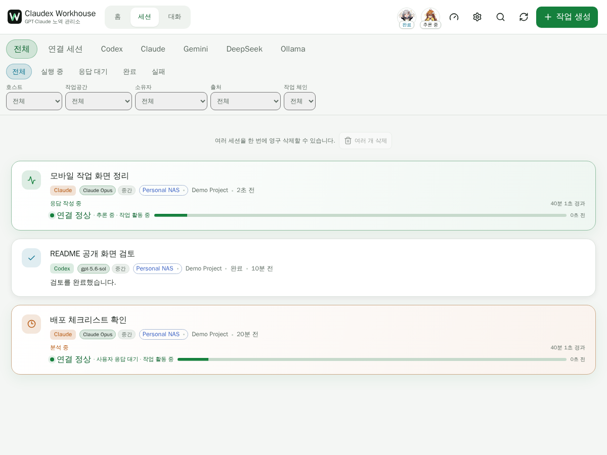
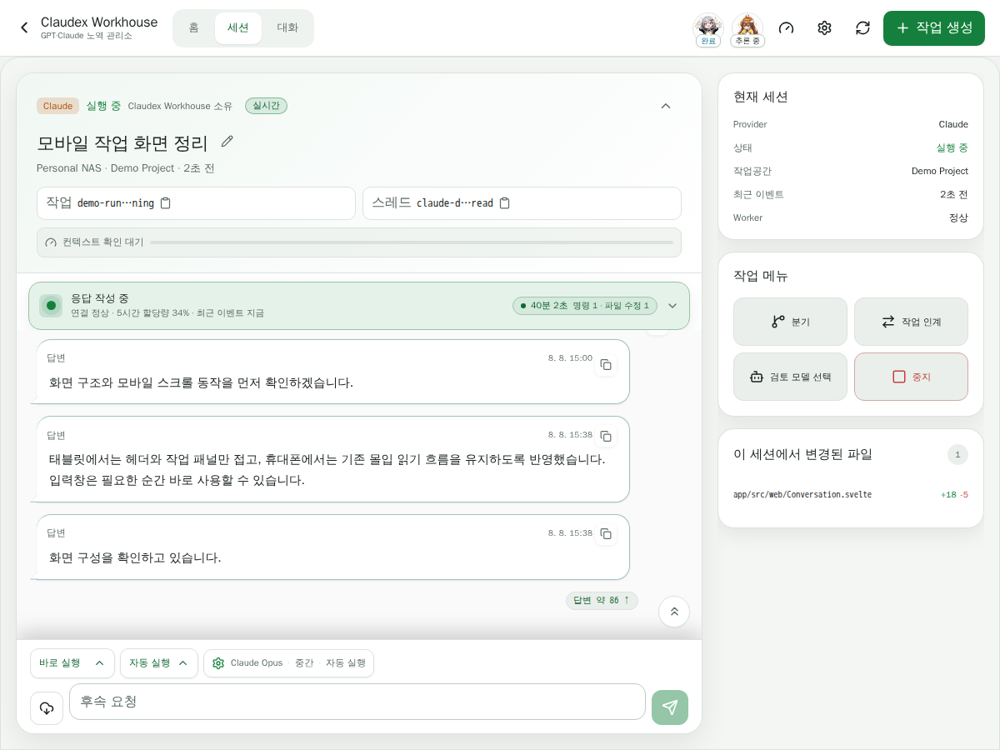
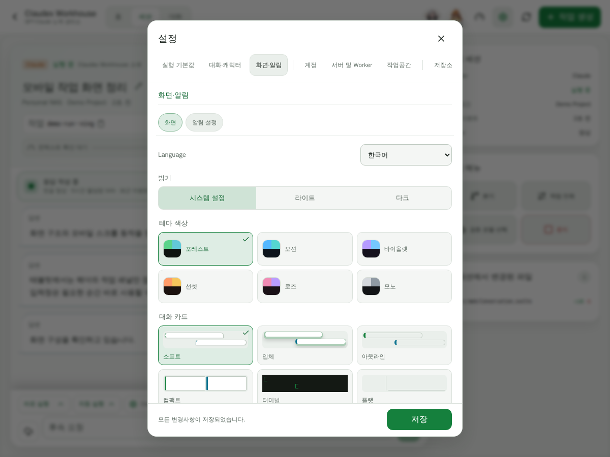
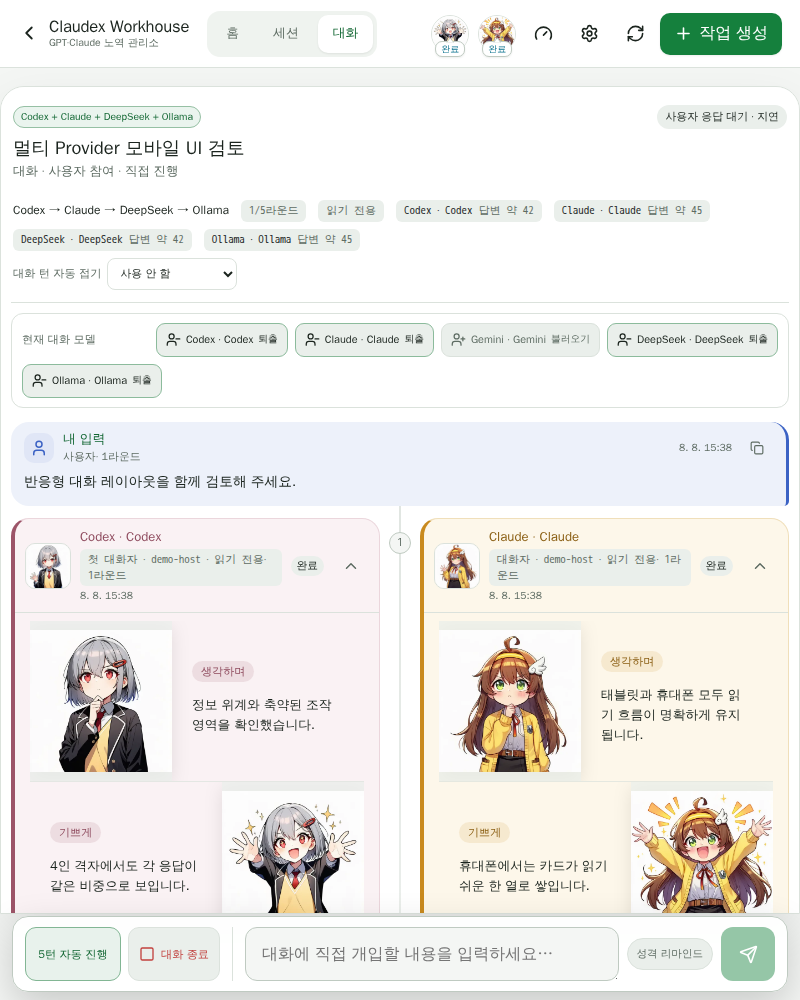
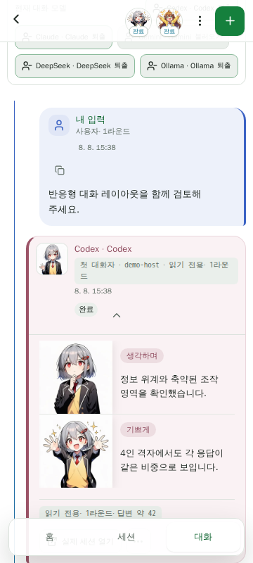

# Claudex Workhouse

[README](../README.md) · [English](introduction.en.md) · [日本語](introduction.ja.md)

[가이드북](guide.ko.md) · 다음: [설치 →](install/index.md)

Claudex Workhouse는 Codex·Claude·Gemini·DeepSeek·Ollama·Grok을 한곳에서 운영하기 위한 셀프 호스팅·모바일 우선 작업대입니다. 장시간 작업을 시작하고, 밖에서 진행 상황을 확인하고, 결과를 검토한 뒤 Provider가 지원하는 세션 경로로 계속 작업하려는 개인 운영자를 위해 만들어졌습니다.

## 화면

  
  

  
  

  
  

현재 Claudex Workhouse UI로 만든 공개용 데모 화면입니다. 실제 운영자의 경로·계정·자격증명·비공개 세션 내용은 포함하지 않습니다.

## 주요 기능

- Provider를 감추지 않는 Codex·Claude·Gemini·DeepSeek·Ollama·Grok 통합 작업 및 세션 화면
- 구현자·검토자 역할, 연결 세션, 영속 타임라인, 수동 상태 변경과 소유자 승인 전 정지를 갖춘 협업 게시판 및 제한된 구현→검토→수정 자동화
- 장시간 작업을 위한 순서 보장 실시간 진행 표시와 재접속·누락 이벤트 복구
- 모든 Provider에 일관된 최종 결과 카드, 변경 파일·산출물 맥락, 잘린 Claude 대화의 이전 턴 명시적 불러오기
- 브라우저에서 워크스페이스, 변경 파일, Git, 로그, 터미널 결과를 안전하게 확인
- Provider가 지원하는 재개, 후속 요청, 포크, 중지, 보관 및 작업 인계
- 여러 Provider가 교대로 발언하고 감정 장면을 보존하며 사용자 입력을 받을 수 있는 대화모드
- 대화 결과를 워크스페이스의 Markdown 결론 문서로 생성
- 데스크톱·태블릿·모바일 대응 레이아웃과 설치형 PWA
- 하나의 논리 프로젝트를 여러 장비의 워크스페이스에 연결하는 송신 전용 Desktop Worker
- 별도 감정 서버 없이 사용할 수 있는 내장 Emotion MCP와 번들 이미지
- 지원 Provider에 역할별 읽기 전용 도구를 연결하는 외부 HTTP MCP 설정, HTTPS 강제, 다시 표시하지 않는 비밀값과 운영자 확인

## 왜 만들었나요?

출발점은 단순했습니다. 휴대폰에서 VS Code 화면을 확대하고 이리저리 움직이며 Codex와 Claude Code의 작업을 확인하는 일이 너무 불편했습니다. 작업은 NAS나 PC에서 실행하고, 휴대폰에서는 진행 상황과 결과를 편하게 확인할 수 있는 전용 화면이 필요했습니다. 또한 기존 공식 AI 앱에서는 제가 사용하던 MCP 기반 감정 이미지와 캐릭터 표현을 작업 흐름에 연결하기 어려웠습니다.

저는 전문 개발자가 아니고, 이 도구를 만들기 전에는 Linux 명령어도 거의 몰랐습니다. 처음부터 멀티 Provider 오케스트레이션 플랫폼을 설계한 것이 아니라, 실제로 사용하면서 막히는 지점을 하나씩 없앴습니다. 모바일 작업 관리, 장시간 세션, 재접속과 복구, 파일·Git 확인, Provider 간 리뷰와 인계, 여러 실행 장치 연결, 대화모드는 모두 그 과정에서 필요할 때마다 추가된 기능입니다.

기초적인 작업·세션 관리 틀을 만든 뒤에야 비슷한 목적의 도구들이 이미 있다는 사실을 알게 되었습니다. 처음에는 별도의 프로젝트를 계속 만드는 것이 의미가 있을지 고민하기도 했습니다.

이 프로젝트는 새로운 분야를 개척했거나 기존 도구보다 우수하다고 주장하기 위한 것이 아닙니다. 비슷한 필요를 가진 사람에게 또 하나의 선택지가 될 수 있도록, 제가 실제로 사용하는 도구를 공개합니다.

처음 작업환경을 만들던 과정

Workhouse 이전에 제가 Claude Code와 Codex를 쓰기 시작한 경로는 대략 다음과 같았습니다.

- Synology NAS에 SSH로 접속
- 웹 Claude에게 CLI 설치 방법을 하나씩 묻고, 받은 명령을 터미널에 복사해 붙여넣기
- 오류가 나면 오류 내용을 다시 웹 Claude에 보여주고 다음 명령을 받는 방식으로 Claude Code CLI를 겨우 설치
- 외부에서 작업하기 위해 VS Code Tunnel을 구성하고, VS Code 안에서 Claude Code를 사용
- 이후 Codex CLI를 설치했지만 VS Code 설정 문제로 Codex 세션이 생성되지 않아, 한동안 Claude Code에게 Codex 백그라운드 세션을 만들어 리뷰를 맡기는 방식으로 우회
- 모바일에서는 VS Code 글씨가 너무 작아, 화면을 스크린샷으로 찍어 웹 Claude나 GPT에게 읽어달라고 하며 작업

정리하면 `NAS SSH → 웹 AI에게 명령어 질문 → CLI 설치 → VS Code Tunnel → Claude Code/Codex → 세션 문제 우회 → 모바일 스크린샷 판독`에 가까운 경로였습니다. 이 경로의 불편을 하나씩 없애는 과정이 그대로 Workhouse의 기능 목록이 되었습니다.

## 왜 Provider 연결을 먼저 쉽게 만들려고 하나요?

초보 사용자에게 가장 큰 초기 장벽은 Linux·Docker·Git 지식 자체가 아니라, AI가 실제 워크스페이스 파일과 명령 실행 환경에 접근할 수 있는 상태를 만드는 일이라고 보고 있습니다. 제가 Workhouse를 만들 수 있었던 것도 프로그래밍 명령어를 직접 익혔기 때문이 아니라, Claude Code와 Codex가 실제 작업환경에 접근한 뒤부터 "이 기능 만들어", "오류 원인 찾아서 고쳐", "Claude가 구현한 것을 Codex가 다시 리뷰해" 같은 자연어 요청으로 작업을 맡길 수 있었기 때문입니다.

그래서 설치 경험에서 중요하게 보는 목표는 모든 시스템 관리 지식을 UI로 가르치는 것이 아니라, 사용자를 가능한 한 빨리 작업 가능한 Claude Code/Codex 앞까지 데려가는 것입니다. 지향하는 흐름은 `Workhouse 설치 → Provider 준비 상태 확인 → Claude Code/Codex 설치 또는 감지 → 공식 로그인 → 워크스페이스 선택 → 첫 자연어 작업 성공`입니다. 이는 이미 완결된 상태가 아니라 현재 설치 보강이 향하는 방향입니다.

외부 접속, Cloudflare, Tailscale, Docker 세부 설정처럼 환경마다 복잡도가 크게 달라지는 부분은 전부 자동화하기보다, Workhouse가 진단과 안내를 제공하고 필요하면 이미 연결된 Claude/Codex에게 자연어로 도움을 요청할 수 있게 하는 쪽이 더 현실적이라고 보고 있습니다. 비개발자도 AI 작업환경을 운영할 가능성은 있지만, 모든 환경 문제가 사라진다고 주장하지는 않습니다. 실제 설치 절차는 [설치](install/index.md)를 참고하세요.

## Provider 고유성을 유지하는 구조

Claudex Workhouse는 여섯 Provider를 출처 없는 범용 에이전트로 합치지 않습니다. Provider 이름, 모델·권한 선택, 작업 소유권, 이어서 실행할 수 있는 세션 ID를 화면에 명확히 표시합니다. Gemini는 Antigravity 에이전트, Vertex Direct 응답 엔진, 또는 Gemini CLI를 쓰는 Vertex Agent로 실행하며, DeepSeek·Ollama·Grok은 설정한 런타임 또는 API 엔드포인트를 사용합니다. 외부에서 시작된 세션은 계속 외부 소유로 취급하며, 운영자가 명시적으로 요청했을 때만 각 Provider가 지원하는 방식으로 Workhouse 관리 후속 작업을 만듭니다.

웹 서비스와 실제 Provider Worker도 분리되어 있습니다. Workhouse UI와 supervisor를 재시작해도 이미 실행 중인 Codex·Claude 작업을 종료하지 않도록 설계되었습니다.

## 개인용 셀프 호스팅

이 프로젝트는 다중 사용자 SaaS 제어판이 아니라 신뢰할 수 있는 개인 환경을 대상으로 합니다. 프로젝트는 서버의 허용 목록에서만 선택되고, 워크스페이스 경로는 호스트에서 검증됩니다. 외부 공개가 필요하면 Cloudflare Access 뒤에 배치할 수 있습니다. 데이터는 로컬 SQLite에 저장되며 NAS 또는 다른 Node.js 호스트에서 직접 실행할 수 있습니다.

인증은 실행 백엔드별 경계를 유지합니다. Codex와 Claude는 공식 런타임, Gemini는 Antigravity Google 세션 또는 Vertex 서비스 계정, DeepSeek·Ollama·Grok은 운영자가 설정한 런타임·엔드포인트와 필요한 비밀값을 사용합니다. Claude 일회성 인증 코드는 CLI에 전달되기 위해 로컬 서버를 잠시 통과할 수 있지만 저장되지 않습니다. 여러 사람이 하나의 Provider 계정을 사용하도록 한 설치본을 공유해서는 안 됩니다. 자세한 내용은 [Provider 인증 방식](provider-authentication.ko.md)을 참고하세요.

## 다중 사용자 지원

Claudex Workhouse는 신뢰할 수 있는 개인 환경을 위한 단일 사용자 도구입니다.

다중 사용자 환경에서는 프로젝트, 워크스페이스, Provider 계정, 실행 권한, Worker, 자격증명 및 세션 기록을 사용자별로 안전하게 격리해야 합니다. 현재 구조는 이러한 보안 경계를 제공하지 않으므로 팀·조직용 사용은 지원하지 않습니다.

단순한 로그인 기능만 추가해 여러 사용자가 함께 사용하는 방식은 안전하지 않으며, 다중 사용자 지원은 현재 개발 범위에 포함되어 있지 않습니다.

설치와 운영 방법은 다음 문서를 참고하세요.

- [배포](deployment.ko.md)
- [Docker 설치](docker.ko.md)
- [Desktop Worker 설치](desktop-worker.ko.md)
- [멀티 호스트 구조](multi-host.ko.md)
- [보안 모델](security.ko.md)
- [Provider 인증 방식](provider-authentication.ko.md)
- [테스트](testing.ko.md)
- [알려진 제한 사항](known-limitations.ko.md)

## 라이선스

Claudex Workhouse는 `AGPL-3.0-only` 라이선스를 사용합니다. 자세한 내용은 [한국어 라이선스 안내](license.ko.md), 법적 효력이 있는 영문 [LICENSE](../LICENSE), [비공식 한국어 번역](../LICENSE.ko.md), [NOTICE](../NOTICE.ko.md)를 참고하세요.
